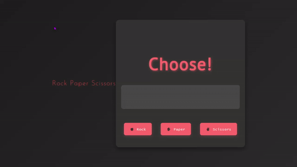
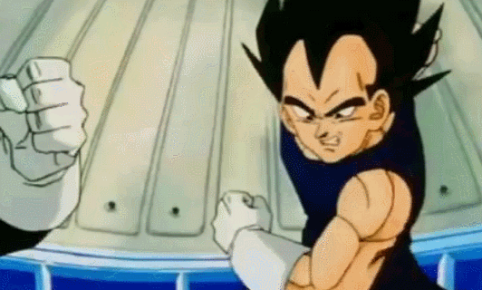

Here's the updated `README.md` with an added header image section and emojis for a more engaging look.

---

# Rock, Paper, Scissors Game 🎮✂️📜🪨


A fun and interactive **Rock, Paper, Scissors** game built with HTML, CSS, and JavaScript! Compete against the computer and see if you can win. Let's play! ✨

## 📖 Table of Contents
- [🎲 Project Overview](#project-overview)
- [⭐ Features](#features)
- [🚀 Getting Started](#getting-started)
  - [📥 Installation](#installation)
  - [🕹️ Usage](#usage)
- [⚙️ How it Works](#how-it-works)
  - [🔍 Main Functions](#main-functions)
- [📂 Project Structure](#project-structure)
- [📈 Future Improvements](#future-improvements)

## 🎲 Project Overview

This project is a simple yet engaging **Rock, Paper, Scissors** game where you can play against a computer. Choose between **Rock**, **Paper**, or **Scissors** and see if you can outsmart the computer's randomly chosen move. 🧠💥

## ⭐ Features

- 🎨 Clean and user-friendly interface
- 📊 Real-time results display
- 🔄 "Play Again" option to reset the game for multiple rounds
- 🌐 Responsive design

## 🚀 Getting Started

### 📥 Installation

Follow these steps to get a local copy up and running:

1. Clone the repository:
   ```bash
   git clone https://github.com/your-username/rock-paper-scissors.git
   ```

2. Navigate into the project folder:
   ```bash
   cd rock-paper-scissors
   ```

3. Open the project in your preferred code editor.

4. Run the game by opening `index.html` in your browser.

### 🕹️ Usage



1. Open the game in your browser.
2. Choose one of the three buttons: **Rock**, **Paper**, or **Scissors**.
3. The computer will pick a move, and the result (Win, Lose, or Tie) will be displayed along with both moves. 🎉
4. Click **"Play Again"** to restart the game and play as many rounds as you’d like!

## ⚙️ How it Works
The game logic is managed through JavaScript functions that process the player's input, determine the winner, and display results.


### 🔍 Main Functions

- **`startGame()`**: Initializes the game with "Rock," "Paper," and "Scissors" buttons, prompting the player to choose.
- **`endGame(event)`**: Triggered by a player's choice, this function calculates the result based on the player’s and computer's moves and displays it.
- **`calcResult(move1, move2)`**: Compares the player’s and computer’s moves to determine if it’s a win, loss, or tie.
- **`randomMove()`**: Generates a random number between 0 and 2 to simulate the computer's move.

## 📂 Project Structure

```
rock-paper-scissors/
├── assets/
│   └── rock-paper-scissors.png       # Icon and header image for the README
├── index.html                         # HTML structure for the game
├── script.js                          # JavaScript logic for the game
├── styles.css                         # CSS styling for the game
└── README.md                          # Project documentation
```

## 📈 Future Improvements

- 🎥 Add animations for more engaging gameplay.
- 📊 Include a scoreboard to track wins, losses, and ties across multiple rounds.
- 🔊 Add sound effects to enhance the game experience.



---
